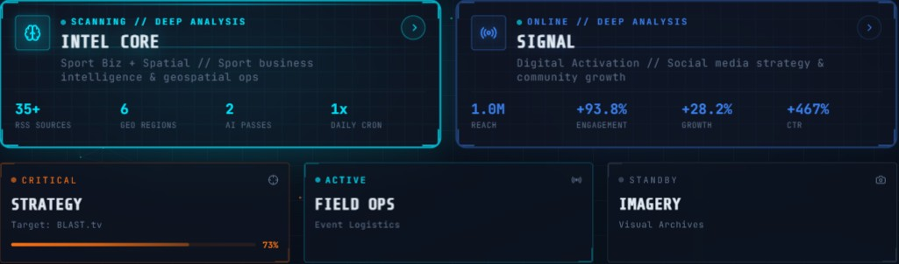

# Jules Moreau — Portfolio


**A production-grade tactical portfolio built entirely with AI — zero coding background.**

**Live:** [julesmoreau.eu](https://www.julesmoreau.eu)

---

## The Challenge

I needed a portfolio for esports operations & event management applications. The problem:

- Zero coding skills
- Every Wix/WordPress template looked the same
- Couldn't create the tactical/strategic identity I envisioned

## The Solution: AI as Creative Co-Pilots

Built from scratch using a **dual-AI workflow** — rough sketches to production in iterations.

### Gemini — Design & Architecture
- Transformed rough sketches into a cohesive tactical/military UI
- Generated the visual identity reflecting a strategic mindset
- Created the foundation and layout architecture

### Claude — Technical Execution
- Built custom CSS animations and particle effects
- Optimized mobile responsiveness
- Solved complex layering and z-index issues
- Fine-tuned performance and interactions

---

## Design System: GOTHAM V.2.7.1

Dark tactical/military aesthetic — single-page application featuring:
- Animated boot sequence with terminal typing effect
- Particle network background with ambient glow
- Modular command grid with status indicators (CRITICAL / ACTIVE / ONLINE / STORAGE)
- Live intel feed ticker (incoming BLAST.tv data stream)
- Geolocated map overlays per module (Copenhagen HQ, Lille campus...)
- Custom cursor, scan lines, glitch effects, and noise overlay

---

## Portfolio Sections



| Code Name | Status | Content |
|-----------|--------|---------|
| **Strategy** | 🔴 CRITICAL | BLAST Strategic Case Study — "David vs. Goliath 2.0" (23-page analysis) |
| **Intel Core** | 🔵 SCANNING | Telegram Veille — AI Intelligence Dashboard — Business, Finance & Geopolitics (live production tool) |
| **Field Ops** | 🟢 ACTIVE | ASI Multisports Tournament — Event Management (450+ personnel) |
| **Signal** | 🟢 ONLINE | ASN95 — Head of Communications (+467% CTR, 1,650+ photos) |
| **Imagery** | 🟡 STORAGE | Photography archive — corporate, events, sport (50+ files) |

---

## Tech Stack

- **Framework:** Next.js 15 (App Router)
- **Language:** TypeScript
- **Styling:** Tailwind CSS 3 + `tailwindcss-animate`
- **UI Components:** Radix UI + shadcn/ui
- **Fonts:** Rajdhani, JetBrains Mono, Share Tech Mono

---

## AI/Crawler Accessibility Layer

The site is a JS-rendered SPA invisible to most crawlers. To fix this:

- **`/llms.txt`** — Plain-text portfolio summary for LLM crawlers
- **JSON-LD** — Schema.org `Person` structured data in `<head>`
- **`sr-only` fallback** — Full HTML content readable by crawlers and screen readers, invisible to sighted users

---

## From Sketch to Production

**Boot Sequence** — Wireframe concept to animated military-style boot screen with terminal typing effects

**GOTHAM Command Grid** — Sketch of modular status panels to fully interactive hub with live feed ticker, geo overlays, and agent profile dossier

**Strategy Panel** — Layout mockup to interactive BLAST case study with live financial data, threat analysis, execution roadmap, and geolocated HQ map (Copenhagen)

**Field Ops Panel** — Brief to immersive field operation UI with body cam simulation, graphic assets viewer, and logistics report

**Signal Panel** — KPI wireframe to full social media analytics display with sponsor activation mechanics and bilingual copywriting gallery

---

## Project Structure

```
app/
  layout.tsx          # Root layout + JSON-LD structured data
  page.tsx            # Main page + sr-only crawler fallback
  globals.css         # Global styles + tactical grid
components/
  command-grid.tsx     # Main navigation hub
  boot-sequence.tsx    # Animated boot sequence
  strategy-panel.tsx   # BLAST case study panel
  intel-core-panel.tsx # Telegram Veille panel
  field-ops-panel.tsx  # ASI Tournament panel
  signal-panel.tsx     # ASN95 comms panel
  imagery-panel.tsx    # Photography panel
  about-panel.tsx      # Agent profile panel
  ui/                  # shadcn/ui components
public/
  llms.txt            # LLM crawler content
  assets/             # PDFs, photos, event visuals
  signal/             # ASN95 media assets
.github/
  images/             # README assets (GIF, screenshots)
```

---

> AI doesn't replace creativity — it amplifies execution. You don't need to be a developer to build something that stands out. Prompt engineering is a real skill.

---

*Private project. All rights reserved.*
