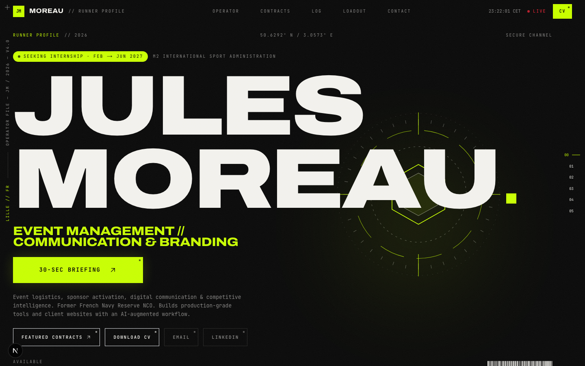
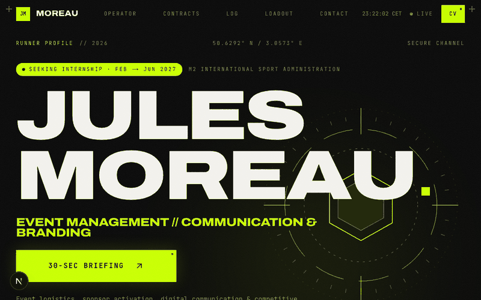
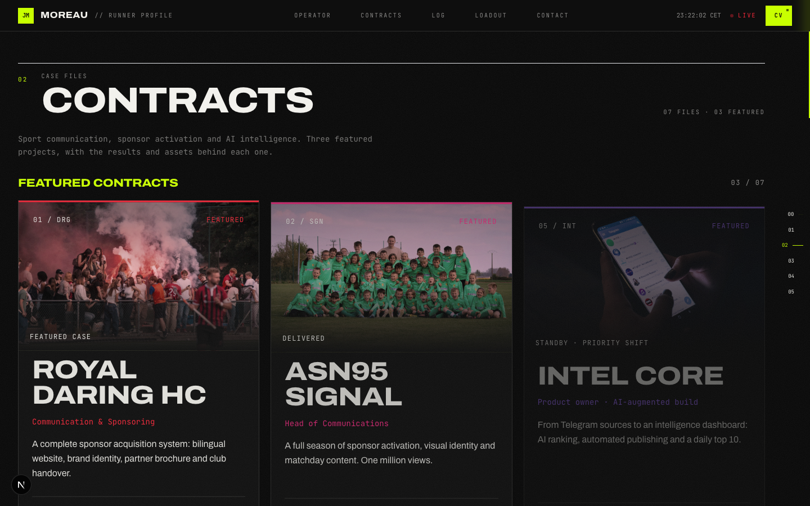

<div align="center">

<code>RUNNER PROFILE // V4.0</code>

# JULES MOREAU — PORTFOLIO

**Event operations × communications × AI-assisted products.**<br />
A portfolio built as a browsable operations dossier — not a conventional landing page.

[](https://nextjs.org/)
[](https://react.dev/)
[](https://www.typescriptlang.org/)
[](https://threejs.org/)
[](https://www.julesmoreau.eu)

[**Enter the live experience ↗**](https://www.julesmoreau.eu) · [30-second briefing](https://www.julesmoreau.eu/briefing) · [Jump to the case files](#case-files)

</div>

[](https://www.julesmoreau.eu)

## The experience

Acid green on black. Wide grotesk type. Registration marks, tactical telemetry and a real-time 3D artifact. The interface moves from a boot sequence to an operator profile, seven contract files, a deployment log and a final extraction point.

<div align="center">
  
  <br />
  <sub>Home page tour — from runner profile to extraction.</sub>
</div>

### Built for two reading speeds

| Surface | Purpose |
| --- | --- |
| **Full experience** | Immersive, scroll-driven portfolio with motion, narrative and project evidence. |
| **30-second briefing** | Recruiter-first scan of role, availability, strongest proof points and contact links. |
| **Contract files** | Seven long-form case studies with context, actions, outputs and measurable results. |
| **Machine-readable layer** | Semantic HTML, JSON-LD, sitemap, robots and `/llms.txt`. |

## Case files



| # | Contract | Role | Selected proof |
| :-- | --- | --- | --- |
| `01` | **Royal Daring HC** | Communication & Sponsoring | Bilingual sponsor website, nine-page partner brochure, brand system and Notion handover. |
| `02` | **ASN95 Signal** | Head of Communications | +467% sponsor CTR, 1M+ views and 1,650+ edited photos. |
| `03` | **BLAST Strategy** | Strategic Analyst | 23-page dossier, PESTEL / VRIO / SWOT and India pivot roadmap. |
| `04` | **ASI Tournament** | Comms Chief | 500+ personnel, two incidents solved and zero disruption. |
| `05` | **Intel Core** | Product Owner | Telegram → Gemini → Notion → Next.js intelligence pipeline at roughly $1/month. |
| `06` | **Client Builds** | AI-assisted Web Delivery | Two client websites shipped or in development. |
| `07` | **Imagery** | Photographer | 50 selected frames across sport, events and corporate work. |

## Under the hood

```text
app/
├── page.tsx                   home: boot → hero → operator → contracts → extraction
├── briefing/page.tsx         recruiter-focused fast path
└── contracts/[slug]/page.tsx seven statically generated case files

components/
├── fx/                       cursor, grain, reveals, wipe, marquee, 3D artifact
├── home/                     the complete home-page narrative
└── contracts/                shared case-study shell + individual dossiers

lib/
├── profile.ts                identity, experience, education and skills
└── contracts.ts              case-file index and metadata
```

### Stack

- **Next.js 15**, App Router, React 19 and TypeScript
- **Tailwind CSS 3** plus a compact custom design system in `app/globals.css`
- **Framer Motion** for reveals, staggers and page wipes
- **Three.js / React Three Fiber / Drei** for the desktop hero artifact
- **Lenis** for smooth scrolling, disabled on touch and reduced-motion devices
- **Archivo Variable** and **JetBrains Mono** through `next/font`

### Experience safeguards

- Static reticle fallback when the real-time 3D scene is not appropriate
- Motion automatically reduced when the operating system requests it
- Smooth scrolling disabled for touch input and reduced motion
- Static generation for every contract route
- Semantic content remains available without relying on animation

## Run locally

```bash
npm install
npm run dev
```

```bash
npm run typecheck
npm run build
```

Then open [`http://localhost:3000`](http://localhost:3000).

## Notes

The product, editorial structure, art direction and implementation were designed and shipped by Jules Moreau through an AI-augmented workflow. The portfolio is a private project; all rights are reserved.

<div align="center">

`50.6292° N / 3.0573° E` · `LILLE / FR` · `© 2026 JULES MOREAU`

</div>
