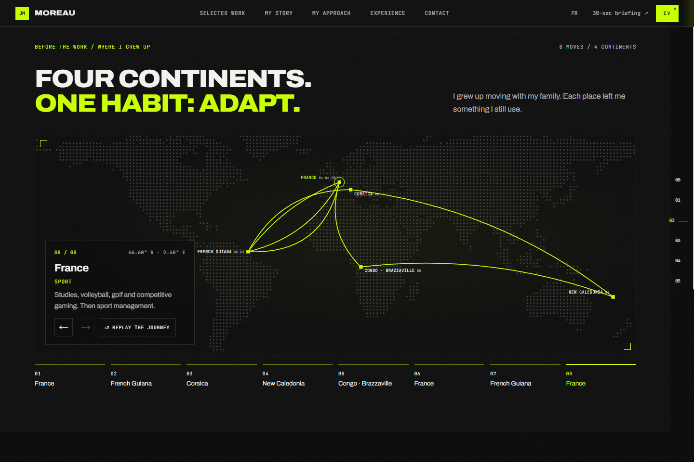

<div align="center">

<code>A PLAYER'S PERSPECTIVE // JULES MOREAU</code>

# JULES MOREAU — PORTFOLIO

**From the field to the tools.**<br />
Digital transformation & AI for sport organisations: a journey from competitive gaming and volleyball coaching, through club communication, partnerships and events, to the tools and AI that help small teams work better.

[](https://nextjs.org/)
[](https://react.dev/)
[](https://www.typescriptlang.org/)
[](https://www.julesmoreau.eu)

**Open to a digital transformation & AI internship · February → June 2027 · France, Belgium, Europe**

[**Enter the live experience ↗**](https://www.julesmoreau.eu) · [30-second briefing](https://www.julesmoreau.eu/briefing) · [Version française](https://www.julesmoreau.eu/fr) · [Jump to the case files](#case-files)

</div>

[](https://www.julesmoreau.eu)

## The experience

Acid green on black. Wide grotesk type, registration marks and digital rain: on desktop, the hero shows Jules in Navy uniform standing in falling code, face blurred and glitching. The homepage opens with the role (digital transformation & AI) and availability, then four selected projects led by the live **Thesis Engine**, the local AI pipeline behind an M2 thesis on generative AI in sports associations.

The story chapter, **From the field to the tools**, explains the shift: every field project in club communication, partnerships and events ended with a tool the team was missing. Four steps trace it (competition → the field → the tools → AI), followed by the method, **People first. Then the tool.**: map how the team really works, build the smallest useful tool, hand it over.



Before the work, a dotted world map replays eight moves across four continents (France, French Guiana, Corsica, New Caledonia, Congo). The route draws itself once in view, stop by stop, with what each place brought; visitors can jump to any stop or replay the journey. Experience, education, a full expandable experience log and internship contact complete the page. Volleyball photos are labelled as personal archive imagery.

On the first home visit, a 3.5-second Matrix introduction plays before the portfolio: a terminal types two wake-up lines, then canvas digital rain pours down and writes JULES MOREAU in glyphs wherever its drops cross the name, and the screen drains from the top onto the hero. It loads no images, and the name is always complete before the exit, even on a slow device. Skip and Escape exit immediately; repeat visits in the same tab session, direct section links and reduced-motion preferences bypass it. The content remains available without JavaScript or if hydration fails. Project introductions are also brief and play once per session.

### Built for two reading speeds

| Surface | Purpose |
| --- | --- |
| **Full experience** | Immersive, scroll-driven portfolio with motion, narrative and project evidence. |
| **30-second briefing** | Recruiter-first scan of role, availability, where I can help, three proof projects and contact links. |
| **Version française** | `/fr` and `/fr/briefing` mirror the home page and the briefing, with an FR/EN switch in the top bar. |
| **Contract files** | Seven long-form case studies (English) with context, actions, outputs and measurable results. |
| **Machine-readable layer** | Semantic HTML, JSON-LD, hreflang, bilingual sitemap, robots, generated share images and `/llms.txt`. |

## Case files


| Code | Contract | Role | Selected proof |
| :-- | --- | --- | --- |
| `THS` | **Thesis Engine** | Builder & Operator | Local AI research pipeline for the M2 thesis: Scholar · OpenAlex · Cairn → fine-tuned Qwen3 4B (+ Claude Sonnet 5.5 when complex) → Obsidian vault, 90 sources a day for ≈ €0. Running 24/7. |
| `DRG` | **Royal Daring HC** | Communication & Sponsoring | A sponsor system built to outlive the internship: bilingual partner website, brand system, Canva templates and a Notion handover exported for any AI assistant. |
| `FLD` | **ASI Tournament** | Communication lead / Field operations | 500+ people, one bilingual participant briefing, a new venue secured in 45 minutes. |
| `SGN` | **ASN95 Signal** | Head of Communications | A digital presence built from scratch: +467% sponsor CTR, 1M+ views and a first app concept. |
| `STR` | **BLAST Strategy** | Strategic Analyst | 23-page dossier, PESTEL / VRIO / SWOT and India pivot roadmap. |
| `BLD` | **Client Builds** | AI-assisted Web Delivery | One live client website and one in development, built with Claude Code and Codex. |
| `IMG` | **Imagery** | Photographer | 50 selected frames across sport, events and corporate work. |

The first four lead the home page; the other three sit in its archive list.

## Under the hood

```text
app/
├── page.tsx                   home: role → projects → story & map → approach → experience → contact
├── briefing/page.tsx         recruiter-focused fast path
├── fr/                       French home page and briefing
├── opengraph-image.tsx       share card (EN; FR in fr/)
└── contracts/[slug]/page.tsx seven statically generated case files

components/
├── fx/                       cursor, grain, reveals, wipe, marquee, analytics
├── home/                     the complete home-page narrative, including the world map
├── briefing/                 the briefing page, shared by both languages
└── contracts/                shared case-study shell + individual dossiers

lib/
├── copy.ts                   every home and briefing string, English and French
├── journey.ts                section order, project stories and map coordinates
├── world-dots.ts             generated dot grid of the world map (2 kB)
├── i18n.ts                   locales, localized paths and hreflang helpers
├── profile.ts                identity, experience, education and skills
├── contracts.ts              case-file index and metadata
├── image-loader.ts           next/image loader for the generated WebP variants
└── og-image.tsx              share card renderer (next/og)

scripts/
├── build-images.mjs          resized WebP variants in public/_img, before dev and build
├── build-hero-portrait.mjs   face-blurred hero portrait from a cut-out photo, run by hand
└── build-world-dots.mjs      dot grid of the world map (lib/world-dots.ts), run by hand
```

### Stack

- **Next.js 15**, App Router, React 19 and TypeScript
- **Tailwind CSS 3** plus a compact custom design system in `app/globals.css`
- **Framer Motion** for reveals, staggers and page wipes
- **sharp** build step and a custom `next/image` loader: resized WebP variants, no runtime image service
- **next/og** share images rendered at build time in the site's fonts
- **Canvas digital rain** in the hero, drawn from a glyph atlas over the portrait at 24 fps
- **Inline SVG world map**: Natural Earth land turned into one path of ~4,000 dots, no map library at runtime
- **Vercel Web Analytics**, cookie-free, with download, email and LinkedIn events
- **Lenis** for smooth scrolling, disabled on touch and reduced-motion devices
- **Archivo Variable** and **JetBrains Mono** through `next/font`

### Experience safeguards

- Thumbnails and galleries load resized WebP variants, never the originals
- Animated counters show their real value in the server HTML and for reduced motion
- The world map plays once; reduced motion and no-JavaScript visits show the full route straight away
- The hero rain pauses off-screen, stays still for reduced motion and is skipped on phones; the portrait's face is blurred in the image file itself
- Motion automatically reduced when the operating system requests it
- Smooth scrolling disabled for touch input and reduced motion
- Static generation for every contract route
- Semantic content remains available without relying on animation

## Run locally

```bash
npm install
npm run dev
```

```bash
npm run typecheck
npm run build
```

`npm run dev` and `npm run build` first run `npm run images`, which only rebuilds variants for new or changed images.

Then open [`http://localhost:3000`](http://localhost:3000).

## Notes

The product, editorial structure, art direction and implementation were designed and shipped by Jules Moreau through an AI-augmented workflow. The portfolio is a private project; all rights are reserved. World map data: [Natural Earth](https://www.naturalearthdata.com/), public domain.

<div align="center">

`50.6292° N / 3.0573° E` · `LILLE / FR` · `© 2026 JULES MOREAU`

</div>
